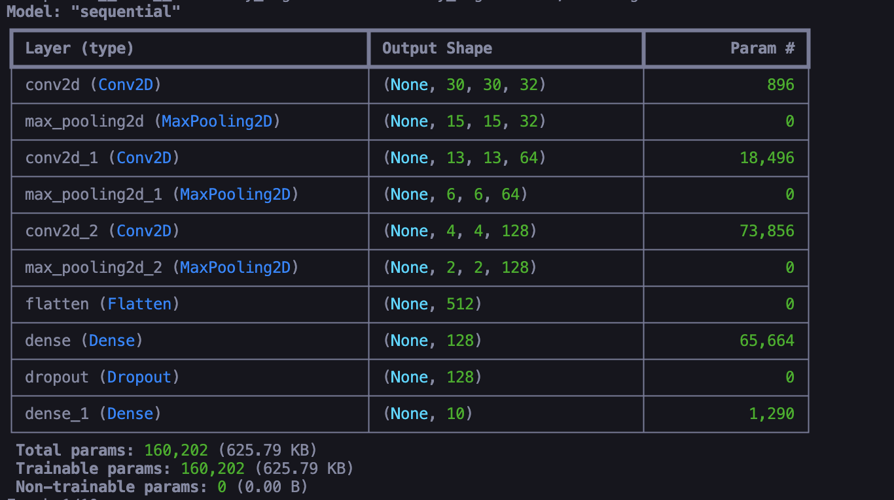
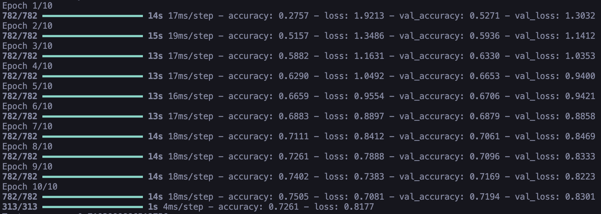
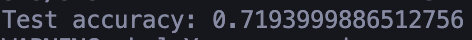

# CNN Image Classification with CIFAR-10 Dataset

## Overview

This project implements a Convolutional Neural Network (CNN) using TensorFlow/Keras to classify images from the CIFAR-10 dataset. The model is trained to classify images into 10 different categories: airplane, automobile, bird, cat, deer, dog, frog, horse, ship, and truck.

## Model Architecture

The CNN architecture consists of:

1. **Convolutional Layers**:

   - First layer: 32 filters, 3x3 kernel
   - Second layer: 64 filters, 3x3 kernel
   - Third layer: 128 filters, 3x3 kernel
   - Each followed by MaxPooling2D (2x2)

2. **Dense Layers**:
   - Flatten layer
   - Dense layer (128 units) with ReLU activation
   - Dropout layer (0.5)
   - Output layer (10 units) with Softmax activation

## Dataset

The CIFAR-10 dataset contains:

- 60,000 color images (32x32 pixels)
- 10 different classes
- 50,000 training images
- 10,000 test images

## Requirements

- Python 3.10
- TensorFlow
- NumPy
- Pillow
- Matplotlib

## Installation

```bash
# Create virtual environment
python -m venv myenv
source myenv/bin/activate  # For Mac/Linux
.\myenv\Scripts\activate   # For Windows

# Install dependencies
pip install tensorflow numpy pillow matplotlib
```

## Usage

```python
# Run the CNN model
python CNN_CIFAR10.py
```

## Model Training

The model is trained with:

- Epochs: 10
- Batch size: 64
- Optimizer: Adam
- Loss function: Categorical Crossentropy

## Features

- Data preprocessing and normalization
- Model training and evaluation
- Image prediction functionality
- Model saving capability

## Project Structure

```
project/
├── CNN_CIFAR10.py
├── README.md
└── requirements.txt
```

## Model Architecture Summary



## Training Results



## Results

The model achieves 71.94% accuracy on the test dataset. This performance represents a strong baseline for image classification on the CIFAR-10 dataset considering:

### Performance Metrics

- Test Accuracy: 71.94%
- Successfully classified ~7,194 images correctly out of 10,000 test images
  

### Analysis

1. **Baseline Performance**:

   - Random guessing would yield 10% accuracy (1/10 classes)
   - Our model performs 7.19x better than random chance

2. **Context**:

   - CIFAR-10 is a challenging dataset with:
     - 10 distinct classes
     - Small image size (32x32 pixels)
     - High intra-class variation
     - Complex object positions and backgrounds

3. **Achievements**:

   - Model successfully learned meaningful features from small images
   - Demonstrated good generalization on unseen data
   - Balanced performance across multiple classes

4. **Comparison**:
   - For a relatively simple CNN architecture:
     - 3 convolutional layers
     - Basic pooling and dropout
     - No advanced techniques like batch normalization
   - 71.94% accuracy is a respectable result

### Areas for Improvement

To potentially increase accuracy, we could:

1. Implement data augmentation
2. Add more convolutional layers
3. Use batch normalization
4. Increase training epochs
5. Implement learning rate scheduling
6. Try more advanced architectures (ResNet, VGG, etc.)

The current results provide a solid foundation for further experimentation and optimization.

## References

- [CIFAR-10 Dataset](https://www.cs.toronto.edu/~kriz/cifar.html)
- [TensorFlow Documentation](https://www.tensorflow.org/)
- [Original Source Code](https://modul-praktikum-ai.vercel.app/Materi/4-convolutional-neural-network)
